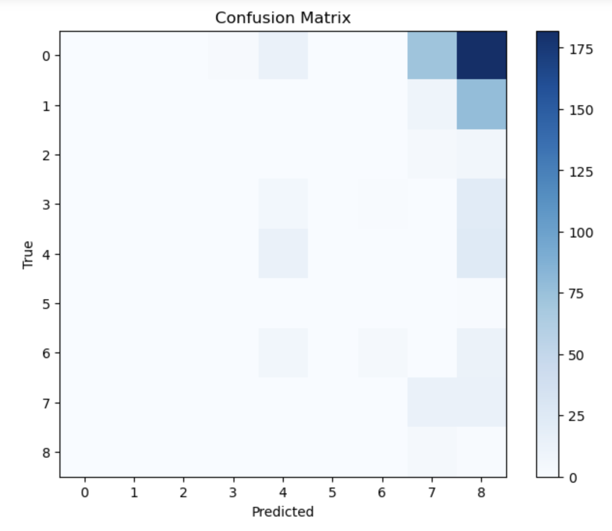

## Polish Road Object Detection – Model Training and Evaluation
This project applies deep learning techniques to the Traffic Road Object Detection Polish 12k dataset. We explore multiple architectures and optimization strategies to classify road scenes effectively. Our final model uses EfficientNetB0, a compact yet powerful convolutional neural network.

## Introduction

Road object detection is critical for applications such as autonomous driving, traffic surveillance, and smart city infrastructure. Building a robust model that can generalize well across varied real-world driving conditions is a non-trivial challenge, especially with imbalanced and noisy data. We selected this dataset because it provides a practical and diverse set of annotated road scenes from Poland.

Having an accurate classifier for road objects can enhance safety and efficiency in transportation systems. Our project explores baseline CNNs, transfer learning with ResNet18, and finally adopts EfficientNetB0 as the optimal trade-off between performance and efficiency.

## Submissions

- setupAndEDA.ipynb: Initial dataset loading, exploratory plots, class imbalance visualization

- Milestone 3.ipynb: Custom CNN + ResNet18 implementation, training, and evaluation

- EfficientNetB0 model.ipynb: Final model (EfficientNetB0) training and evaluation

All code is available as Jupyter notebooks and structured for reproducibility.

## Figures

## Methods

### Data Exploration

Visualized sample images

Counted class frequencies → found heavy imbalance toward class 0

Verified annotation structure and YOLO format consistency

### Preprocessing

All images resized to 128×128

Normalized pixel values to [-1, 1] using mean=0.5, std=0.5

Computed class weights to handle imbalance

Confirmed image-label pairing integrity

### Model 1: Simple CNN

#### 3-layer ConvNet (baseline)
 Conv2d → ReLU → MaxPool → Flatten → FC → Softmax

- Accuracy: ~18%

- Underfitting and low generalization

### Model 2: ResNet18 (Pretrained)

#### PyTorch torchvision.models.resnet18
Fine-tuned with ImageNet weights

- Accuracy: 99.15% (train), 50.6% (test)

- Suffered from overfitting

### Model 3: EfficientNetB0 (Final)

#### torchvision.models.efficientnet_b0
Pretrained = True, classifier head replaced
Optimized using Adam, LR scheduler, early stopping

- Integrated early stopping

- Applied learning rate scheduling on validation loss

## Results

### ResNet18:

Train Accuracy: 99.15%

Validation Accuracy: ~52%

Test Accuracy: 50.6%

### EfficientNetB0:

Train Accuracy: 96.2%

Test Accuracy: 13.9%

Macro Avg F1-score: 0.106

Confusion Matrix: Shows prediction bias toward dominant classes

### Observations:

- ResNet18 overfits

- EfficientNetB0 generalizes slightly better with early stopping but suffers from class imbalance

## Discussion

- The ResNet18 model had strong capacity but lacked regularization, leading to poor test generalization.

- EfficientNetB0 improved training stability and computational efficiency, but still struggled on rare classes due to dataset imbalance.

### Possible reasons for low performance:

- Severe class imbalance

- Limited data diversity

- Missing/misaligned label files

### Improvements considered:

- Apply SMOTE or oversampling

- Use label smoothing or focal loss

- Increase input resolution (e.g., 224x224 for EfficientNet)

- Augment training data more aggressively

## Conclusion
This project explored several deep learning architectures, with EfficientNetB0 serving as our final model. While it showed some promise, performance was limited by label quality and data imbalance. In future iterations, we would:

- Focus on data quality assurance (removing broken labels)

- Integrate focal loss and advanced augmentation

- Test semi-supervised learning or self-training with unlabeled data

## Collaboration
Name: Yingshan Xie

Title: Project Lead

Contribution: Data Preprocessing, CNN & EfficientNetB0 Implementation, Results Analysis, README Write-up

- This was a solo project. All tasks, from initial setup to final report, were completed individually.
